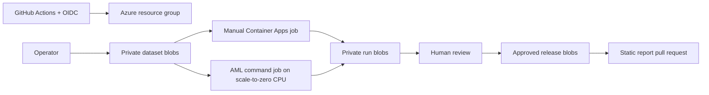

# MCIFT public benchmarks

Reproducible, fail-closed preparation for two proposed public benchmark studies:

- NASA IMS Set 2 bearing early warning;
- Exathlon Spark telemetry anomaly propagation.

Both scientific benchmarks have now been executed into private Azure run storage;
no scientific result has been approved or published. The repository contains
software tests on synthetic arrays only. MCIFT remains a speculative framework;
this project does not claim validation or replace established methods.

## Safety gates

Source datasets, credentials, storage keys, SAS tokens, run outputs, and generated
reports are excluded from Git. Scientific jobs are manual-only and require exact
typed confirmations. Publication reads only from the private `approved-releases`
container and opens a review pull request.

## Layout

- `benchmarks/`: pinned Python package, container, schemas, frozen/unresolved configs.
- `infra/`: Bicep and guarded Azure scripts.
- `datasets/`: lawful acquisition and private staging guidance.
- `docs/benchmarks/`: result-free static publication shell.
- `.github/workflows/`: CI, image, provisioning, run, and publication gates.

## Quick validation

```bash
python -m pip install -e "./benchmarks[dev]"
python -m pytest benchmarks/tests/synthetic
python -m mcift_benchmarks --help
az bicep build --file infra/bicep/main.bicep
```

See [benchmarks/README.md](benchmarks/README.md), [infra/README.md](infra/README.md),
and [PREPARATION_REPORT.md](PREPARATION_REPORT.md).

## Architecture



## License

AGPL-3.0-only, with a separate commercial-licensing notice. See `LICENSE` and
`COMMERCIAL-LICENSE.md`.
