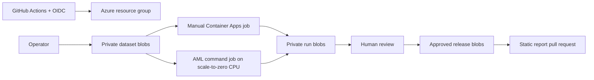

# MCIFT public benchmarks

Reproducible, fail-closed preparation for two proposed public benchmark studies:

- NASA IMS Set 2 bearing early warning;
- Exathlon Spark telemetry anomaly propagation.

No scientific benchmark has been run or published. The repository contains
software tests on synthetic arrays only. MCIFT remains a speculative framework;
this project does not claim validation or replace established methods.

## Safety gates

Source datasets, credentials, storage keys, SAS tokens, run outputs, and generated
reports are excluded from Git. Scientific jobs are manual-only and require exact
typed confirmations. Publication reads only from the private `approved-releases`
container and opens a review pull request.

## Layout

- `benchmarks/`: pinned Python package, container, schemas, frozen/unresolved configs.
- `infra/`: Bicep and guarded Azure scripts.
- `datasets/`: lawful acquisition and private staging guidance.
- `docs/benchmarks/`: result-free static publication shell.
- `.github/workflows/`: CI, image, provisioning, run, and publication gates.

## Quick validation

```bash
python -m pip install -e "./benchmarks[dev]"
python -m pytest benchmarks/tests/synthetic
python -m mcift_benchmarks --help
az bicep build --file infra/bicep/main.bicep
```

See [benchmarks/README.md](benchmarks/README.md), [infra/README.md](infra/README.md),
and [PREPARATION_REPORT.md](PREPARATION_REPORT.md).

## Local IMS six-gate benchmark

The local runner depends on the authoritative `corpobear/MCIFT` package and uses
`mcift.exchange.vibration.v1` with `mcift.gates.ims-six-gate.v1`. It does not copy
MCIFT mathematics. Install the sibling checkout and validate the frozen split:

```powershell
python -m pip install -e ../MCIFT
python -m pip install -e "./benchmarks[dev]"
cd benchmarks
python -m mcift_benchmarks ims show-split --config configs/ims-set2-v1.yaml
python -m mcift_benchmarks ims run --config configs/ims-set2-v1.yaml --dataset-root D:/datasets/IMS/2nd_test --mcift-repo ../../MCIFT --output-root artifacts
```

The dataset is never downloaded automatically or committed. See
[docs/ims-local-run.md](docs/ims-local-run.md).

> The benchmark evaluates the predictive and anomaly-detection behaviour of a frozen
> software method. It does not validate MCIFT as a physical theory.

## Architecture



## License

AGPL-3.0-only, with a separate commercial-licensing notice. See `LICENSE` and
`COMMERCIAL-LICENSE.md`.

